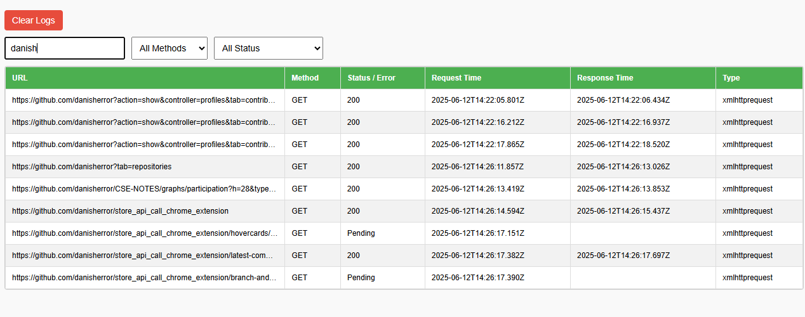

----
# How to use the extension
-----
- Download this repo
- Open chrome
- Enable Developer mode
- click on Load unpacked
- Go to the folder where you have clone this repo

- If you are doing changes in the code
    - after doing changes into the code, go to the chrome extension page and click on refresh the extension, it will load the extension with your changes

-------------------

